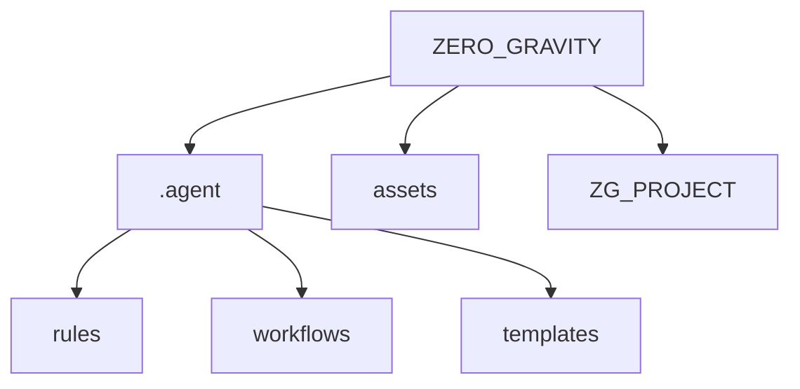

<div align="center">


# ZERO_GRAVITY

[](https://github.com/Sunwood-ai-labs/ZERO_GRAVITY)
[](https://github.com/Sunwood-ai-labs/YOROZU)
[](LICENSE)

[](README.jp.md)

</div>

## Overview

**ZERO_GRAVITY** is the meta-framework repository for **GA-Workspace** (Google Antigravity Workspace).
This project serves as an experimental platform that provides a new development experience, freed from the constraints (gravity) of traditional development processes, and forms the foundation for next-generation agent-driven development.

This workspace incorporates an advanced governance model composed of **49+ definition files**, enabling autonomous project management centered around the following "Golden Triangle":

1.  **Tech Stack Rule (`stack.md`)**: Standardization of technology selection
2.  **Operational Rule (`ops.md`)**: Definition of operational processes
3.  **Core Workflows**: Automation of development cycles

## Features

GA-Workspace is designed based on the following principles:

- **Recursive Composition**: Efficiently solves complex tasks through hierarchical combinations of rules and workflows.
- **Rule-based Governance**: Agents autonomously make decisions and take actions according to policies defined in `.agent/rules`.
- **Automated Workflows**: Automates the entire development cycle based on procedures defined in `.agent/workflows`.

## Included Capabilities

This repository comes pre-configured with the following rules and workflows.

### Rules (Governance)
| Category | Files |
|----------|-------|
| **Meta** | `ga-workspace-definition`, `project-governance`, `meta-rule-creation` |
| **System** | `stack`, `security-mandates`, `ops` |
| **Development** | `type-safety`, `react-components`, `testing-standards` |
| **Persona** | `character-rules-seira`, `japanese-rules` |

### Workflows (Automation)
| Category | Workflows |
|----------|-----------|
| **Setup & Core** | `/setup-ga-workspace`, `/create-repo-from-folder`, `/manage-agent-config` |
| **Development** | `/create-feature`, `/bug-fix`, `/refactor-legacy`, `/build-app-simple` |
| **Quality** | `/verify-code`, `/lint-check`, `/type-check`, `/run-tests`, `/security-scan` |
| **Release** | `/create-release`, `/git-auto-commit`, `/generate-header-image` |
| **Helper** | `/create-rule`, `/create-workflow`, `/generate-readme`, `/generate-unit-tests` |

## Directory Structure



### Governance Structure (.agent)

```plaintext
.agent
├── rules/                      # Agent Constitution
│   ├── 00-ga-workspace-definition.md
│   ├── 01-project-governance.md
│   ├── 02-stack.md
│   ├── 03-security-mandates.md
│   ├── 10-character-rules-seira.md
│   ├── ... (Total 20 rules)
├── workflows/                  # Standard Operating Procedures
│   ├── setup-ga-workspace.md
│   ├── git-auto-commit.md
│   ├── create-release.md
│   ├── verify-code.md
│   ├── ... (Total 27 workflows)
└── templates/                  # Artifact Templates
    └── release_notes_template.md
```

## Getting Started

This repository functions as a **source (template)** for new GA-Workspace projects.

### 1. Creating a New Project

```bash
# Initialize with Agent workflow
/setup-ga-workspace
```

### 2. Converting an Existing Project to GA-Workspace

```bash
# Convert target directory
/create-repo-from-folder
```

### 3. Extending the Environment

```bash
# Create new rule
/create-rule

# Define new workflow
/create-workflow
```

## Related Projects

- **[YOROZU](https://github.com/Sunwood-ai-labs/YOROZU)**: The foundation of strict governance.

---

<p align="center">
  Generated by <b>ZERO_GRAVITY</b>
</p>
